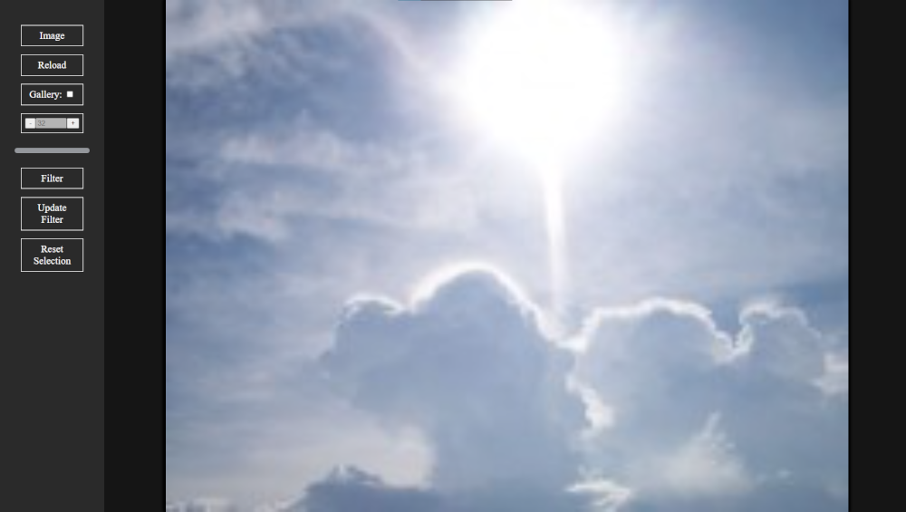
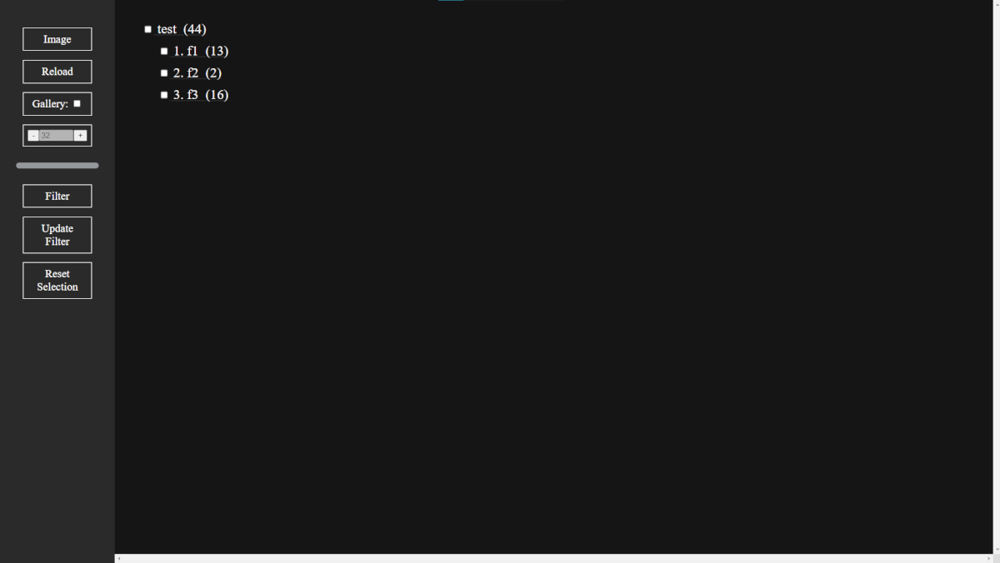

# Gallery Randomizer API

**Tech Used:** HTML, Javascript, CSS, Python, FastAPI

## Description
Create and run an API that lets users retrieve random image or selected image
from a specified directory on your computer. Project also has sample client to retrieve images from this API.

## How to Use

### Api Setup 

**Setup Requirments**  

```pip install -r requirements.txt```

**Configuration:**
Edit values in config.ini
- folderName: Name of starting directory that contains all images
- depth: Recursion depth before subdirectories aren't listed. 0  means list only root directory, -1 means list all subdirectories.
- url: Host url that API will be running on
- port: port that the API will be running on

**Run:** 

```python api.py```

### Using the API

**Files Data**

Get requests to the  ```/data``` endpoint returns a JSON object representing the file tree structure. The object is in the form of 
```
{name: "directory_name", 
pos: position of directory in parent (0 if root),
count: recursive count of files inside directory (including subdirectories), 
children: [list of all subdirectories as same type of object]}
```

**Image Endpoint**

The ```/image``` endpoint returns a random image from the root directory or any subdirectory within the root directory. It also returns the relative path from the root directory for the file in the "path" header and the number of the file in the "pos" header.

#### **Query Parameters**

To add query parameters do ```/image?dirs=dirs_value&num=num_value```

**dirs:**

This parameter lets user choose which subdirectories to include. If not specified, it searches through all subdirectories. It takes in a comma separated list of all the directory paths. The directory paths should used the **pos** property of each directory, not the name, and should not include the root directory. 

Example
```js
file_data = {name: "root_name", pos: 0, count: 10, children[
    {name: "child1", pos: 1, count: 8, children: 
    [
        {name: "subchild1", pos: 1, count: 5, children:[]},
        {name: "subchild2", pos: 2, count: 2, children:[]},
        {name: "subchild3", pos: 3, count: 1, children:[]},
    ]}
]}
// Only search directories root/child1/subchild1 and root/child1/subchild3
paramater = "?dirs=1/1/,1/3/"
```

**num:**

Allows users to choose specific file instead of retriving random file. Setting ```?num=n``` gets the nth file in the directory. If only certain directories are selected using ```dirs```, it gets the nth file of the files in the selected directories. n should be greater than 0, and if it is greater than the total amount of files available it starts at the beginning (1) again. ```num = (num-1) % total + 1```. The header "pos" returns the num of the file.


### Client

A simple webpage that shows an example of how to retrieve images from the api.

**To configure**

At the top of index.js, set corresponding url and port to match api url and port.
```js
let apiURL = 'http://127.0.0.1:8000/' //url::port
```

#### Image Page
Clicking Image button takes user to the image page. Pressing reload button or 'r' key gets a new image. Pressing F full screens image and hides navbar. Pressing 'i' shows the relative path of the directory the image is from at the bottom. The number input shows which number image it is, and can be modified only in gallery mode.



#### Gallery Mode
Click the checkbox to enable. In gallery mode, go to next or previous image by clicking the buttons or pressing 'right' or 'left' arrow. This increases the current num value and requests the next image number from the api. Adding filters and then reloading in gallery mode causes it to go to start of gallery. 

#### Filter Page
The filter page allows users to select which subdirectories to include in image search. Selecting the top directory also selects all subdirectories within it. Click update filter button to apply the filters, and reset selection to unselect all subdirectories. If no subdirectories are selected, it doesn't send "dirs" parameter and api looks through all images. 

